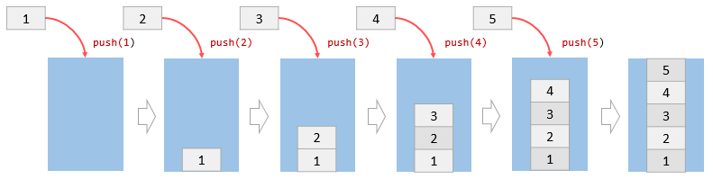

# Getting started with JavaScript by Vicma
### [This guide it's deploying by Manuel Aldaraca](https://github.com/vicmaburrito)

# First Steps on JavaScript

## JS Best Practices

### [Code Clean](https://devinduct.com/blogpost/22/javascript-clean-code-best-practices)

## JavaScript in the browser

-   Do not commit **console.log** to your repo. It’s ugly, it kills
    performance and it can make confidential data be visible to anyone
    using the browser tools to look at your website.
-   Do not use **window.alert()** or **window.confirm()**. It’s ugly,
    impossible to style, it stops code execution and displays
    differently on different browsers. Use custom modal instead.
-   Keep the number of changes/updates to the DOM as low as possible,
    they are very expensive for the browser.
-   Keep the application logic separated from DOM manipulation tasks.
-   Do not use **document.write** or **eval**
-   Add **node<sub>modules</sub>** dir to you.gitignore file as all
    those files are not needed in your repo (each team member will
    install all packages thanks to your package.json file).

## Using a basic operators to create logic

### It was Tested and Started with a general Variables as:

-   **Var** keyword is used in pre-ES6 versions of JS.
-   **let** Is the preferred way to declare a variable when it can be
    reassigned.
-   **const** is the preferred way to declare a variable with a constant
    value.

## Other Concepts

### Undefined

1.  Variables that have not been initialized store the primitive data
    type **undefined**.

    ``` javascript
    var a;

    console.log(a); 
    // Prints: undefined
    ```

### Mathematical Operators

1.  Math.random();

    -   **The Math.random()** function returns a floating-point, random
        number in the range from 0 (inclusive) up to but not
        including 1.

    ``` javascript
    console.log(Math.random());
    // Prints: 0 - 0.9

    Math.random();
    // Returns a number between 0 and 1 

    Math.random();
    // ☝️ Math is the library
    ```

2.  String .length

    -   The **.length** property of a string returns the number of
        characters that make up the string.

    ``` javascript
    let message = 'good nite';
    console.log(message.length);
    // Prints: 9
    ```

3.  Math.floor()

    -   The **Math.floor()** function returns the largest integer less
        than or equal to the given number.

    ``` javascript
    console.log(Math.floor(5.95)); 
    // Prints: 5 
    ```

4.  Remainder / Modulo Operator

    -   The remainder operator, sometimes called modulo, returns the
        number that remains after the right-hand number divides into the
        left-hand number as many times as it evenly can.

    ``` javascript
    // calculates # of weeks in a year, rounds down to nearest integer
    const weeksInYear = Math.floor(365/7);

    // calcuates the number of days left over after 365 is divded by 7
    const daysLeftOver = 365 % 7 ;

    console.log("A year has " + weeksInYear + " weeks and " + daysLeftOver + " days");
    ```

5.  Assignment Operators

    An assignment operator assigns a value to its left operand based on
    the value of its right operand. Here are some of them:

    -   **+=** addition assignment
    -   **-=** subtraction assignment
    -   \*= multiplication assignment
    -   **/=** division assignment

    ``` javascript
    let number = 100;

    // Both statements will add 10
    number = number + 10;
    number += 10;

    console.log(number); 
    // Prints: 120
    ```

6.  Template Literals

    -   Template literals are strings that allow embedded expressions,
        **${expression}**. While regular strings use single ' or double
        " quotes, template literals use backticks instead.

    ``` javascript
    let name = "Vicma";
    console.log(`Hello, ${name}`); 
    // Prints: Hello, Vicma

    console.log(`Burrito is ${6+8} years old.`); 
    // Prints: Burrito is 14 years old.
    ```

7.  Let Keyword

    **let** creates a local variable in JavaScript & can be re-assigned.
    Initialization during the declaration of a **let** variable is
    optional. A **let** variable will contain **undefined** if nothing
    is assigned to it.

    ``` javascript
    let count; 
    console.log(count); // Prints: undefined
    count = 10;
    console.log(count); // Prints: 10

    ```

## JavaScript — Double Equals vs. Triple Equals

### [ JS Doble Equals vs. Triple Equals](https://codeburst.io/javascript-double-equals-vs-triple-equals-61d4ce5a121a)

# JS Conditional

## Logical Operator

-   The logical OR operator **\|\|** checks two values and returns a
    boolean. If one or both values are truthy, it returns **true**. If
    both values are falsy, it returns **false**.

``` javascript
true || false;        // true
10 > 5 || 10 > 20;    // true
false || false;       // false
10 > 100 || 10 > 20;  // false
```

-   Table with the concept explain it

| A     | B     | A B   |
|-------|-------|-------|
| false | false | false |
| false | true  | true  |
| true  | false | true  |
| true  | true  | true  |

-   The **!** not operator reverses, or negates, the value of a boolean:

``` javascript
let excited = true;
console.log(!excited); // Prints false

let sleepy = false;
console.log(!sleepy); // Prints true
```

js

Essentially, the **! operator will either take a true** value and pass
back **false**, or it will take a **false** value and pass back
**true**.

-   When we use the **&&** operator, we are checking that two things are
    **true**

``` javascript
if (stopLight === 'green' && pedestrians === 0) {
  console.log('Go!');
} else {
  console.log('Stop');
}
```

js

When using the **&&** operator, both conditions must evaluate to
**true** for the entire condition to evaluate to **true** and execute.
Otherwise, if either condition is **false**, the **&&** condition will
evaluate to **false** and the **else** block will execute.

If we only care about either condition being **true**, we can use the
**\|\|** operator:

``` javascript
if (day === 'Saturday' || day === 'Sunday') {
  console.log('Enjoy the weekend!');
} else {
  console.log('Do some work.');
}
```

js

When using the **\|\|** operator, only one of the conditions must
evaluate to **true** for the overall statement to evaluate to **true**.
In the code example above, if either **day `=` 'Saturday'** or **day `=`
'Sunday'** evaluates to **true** the \*if\*‘s condition will evaluate to
**true** and its code block will execute. If the first condition in an
**\|\|** statement evaluates to **true**, the second condition won’t
even be checked. Only if **day `=` 'Saturday'** evaluates to **false**
will **day `=` 'Sunday'** be evaluated. The code in the **else**
statement above will execute only if both comparisons evaluate to
**false**.

## Add Items to an Array with push() and unshift().

-   Both methods take one or more elements as parameters and add those
    elements to the array the method is being called on; the **push()**
    method adds elements to the end of an array, and **unshift()** adds
    elements to the beginning. Consider the following:

``` javascript
let twentyThree = 'XXIII';
let romanNumerals = ['XXI', 'XXII'];

romanNumerals.unshift('XIX', 'XX');
// *romanNumerals* would have the value *['XIX', 'XX', 'XXI', 'XXII']*.

romanNumerals.push(twentyThree);
// *romanNumerals* would have the value *['XIX', 'XX', 'XXI', 'XXII', 'XXIII']*. 
//Notice that we can also pass variables, which allows us even greater flexibility in dynamically modifying our array's data.
```

## Remove Items from an Array with pop() and shift()

-   **pop()** removes an element from the end of an array, while
    **shift()** removes an element from the beginning.

``` javascript
let greetings = ['whats up?', 'hello', 'see ya!'];

greetings.pop();
```

-   greetings would have the value \['whats up?', 'hello'\].

``` javascript
greetings.shift();

- greetings would have the value ['hello'].
```

-   We can also return the value of the removed element with either
    method like this:

``` javascript
let popped = greetings.pop();
```

-   greetings would have the value \[\], and popped would have the value
    hello.

## Could be a example this code:

``` javascript
function popShift(arr) {
  let popped = arr.pop();
  let shifted = arr.shift() ; 
  let answer = popped +' '+ shifted; //I'm not sure if this declariton it's correct 
  return [answer];
}

console.log(popShift(['challenge', 'is', 'not', 'complete']));
```

Please leave a comment or open a issue with a refactor of the above code

### we can use this code as well (It’s as above code, but this code was tested & already worked properly):

``` javascript
function popShift(arr) {
  let popped = arr.pop(); 
  let shifted = arr.shift() ; 
  return [shifted, popped];
}

console.log(popShift(['challenge', 'is', 'not', 'complete']));
```

## Add Items Using splice()

-   The second occurrence of 12 is removed, and we add 13 and 14 at the
    same index. The numbers array would now be \[ 10, 11, 12, 13, 14, 15
    \].
-   Here, we begin with an array of numbers. Then, we pass the following
    to splice(): The index at which to begin deleting elements (3), the
    number of elements to be deleted (1), and the remaining arguments
    (13, 14) will be inserted starting at that same index. Note that
    there can be any number of elements (separated by commas) following
    amountToDelete, each of which gets inserted.

``` javascript
const numbers = [10, 11, 12, 12, 15];
const startIndex = 3;
const amountToDelete = 1;

numbers.splice(startIndex, amountToDelete, 13, 14);
console.log(numbers);
```

## Copy Array Items Using slice()

-   The next method we will cover is slice(). Rather than modifying an
    array, slice() copies or extracts a given number of elements to a
    new array, leaving the array it is called upon untouched. slice()
    takes only 2 parameters — the first is the index at which to begin
    extraction, and the second is the index at which to stop extraction
    (extraction will occur up to, but not including the element at this
    index). Consider this:

``` javascript
let weatherConditions = ['rain', 'snow', 'sleet', 'hail', 'clear'];

let todaysWeather = weatherConditions.slice(1, 3);
```

-   todaysWeather would have the value \['snow', 'sleet'\], while
    weatherConditions would still have \['rain', 'snow', 'sleet',
    'hail', 'clear'\].

### Another example:

``` javascript
function forecast(arr) {
  // Only change code below this line

  return arr.slice(2,4);
}

// Only change code above this line
console.log(forecast(['cold', 'rainy', 'warm', 'sunny', 'cool', 'thunderstorms']));
```

## Copy an Array with the Spread Operator

-   While slice() allows us to be selective about what elements of an
    array to copy, among several other useful tasks, ES6's new spread
    operator allows us to easily copy all of an array's elements, in
    order, with a simple and highly readable syntax. The spread syntax
    simply looks like this: **…**

In practice, we can use the spread operator to copy an array like so:

``` javascript
let thisArray = [true, true, undefined, false, null];
let thatArray = [...thisArray]; //Output: [true, true, undefined, false, null]
```

## Exercise

### We have defined a function, copyMachine which takes arr (an array) and num (a number) as arguments. The function is supposed to return a new array made up of num copies of arr. We have done most of the work for you, but it doesn't work quite right yet. Modify the function using spread syntax so that it works correctly (hint: another method we have already covered might come in handy here!).

``` javascript
function copyMachine(arr, num) {
  let newArr = [];
  while (num >= 1) {
    // Only change code below this line

    // Only change code above this line
    num--;
  }
  return newArr;
}

// copyMachine([true, false, true], 2) should return [[true, false, true], [true, false, true]]

console.log(copyMachine([true, false, true], 2));
```

1.  Solution

    ``` javascript
    newArr.push([...arr]);
    ```

## Combine Arrays with the Spread Operator

``` javascript
function spreadOut() {
  let fragment = ['to', 'code'];
  let sentence = ['learning', ...fragment, 'is', 'fun']
  return sentence;
}

console.log(spreadOut());
```

## Check For The Presence of an Element With indexOf()

### Example

-   JavaScript provides us with another built-in method, indexOf(), that
    allows us to quickly and easily check for the presence of an element
    on an array. indexOf() takes an element as a parameter, and when
    called, it returns the position, or index, of that element, or -1 if
    the element does not exist on the array.

``` javascript
let fruits = ['apples', 'pears', 'oranges', 'peaches', 'pears'];

fruits.indexOf('dates');
fruits.indexOf('oranges');
fruits.indexOf('pears');
// Output: indexOf('dates') returns -1, indexOf('oranges') returns 2, and indexOf('pears') returns 1 (the first index at which each element exists).
```

### Exercise

1.  We have defined a function, quickCheck, that takes an array and an
    element as arguments. Modify the function using indexOf() so that it
    returns true if the passed element exists on the array, and false if
    it does not.

    -   The quickCheck function should return a boolean (true or false),
        not a string ("true" or "false")

    ``` javascript
    function quickCheck(arr, elem) {
      // Only change code below this line

      // Only change code above this line
    }

    console.log(quickCheck(['squash', 'onions', 'shallots'], 'mushrooms'));
    ```

2.  Solution

    ``` javascript
    if (arr.indexOf(elem) >= 0){
      return true;
    } else {
     return false;
    }
    ```

3.  Refactoring

    ``` javascript
    return arr.indexOf(elem) >= 0 ? true : false;
    ```

# Implementing Javascript Stack Using an Array

## Introduction to the stack data structure

-   A stack is a data structure that holds a list of elements. A stack
    works based on the LIFO principle i.e., Last In, First out, meaning
    that the most recently added element is the first one to remove.

-   A stack has two main operations that occur only at the top of the
    stack: push and pop. The push operation places an element at the top
    of stack whereas the pop operation removes an element from the top
    of the stack.

## The name **stack**

-   The name stack comes from the analogy to a set of physical items
    e.g., DVD disc, books, stacked on top each other.

-   A stack has many applications. For example, the simplest one is to
    reverse a word. To do it, you push a word into the stack, letter by
    letter, and pop the letters from the stack.

-   The other applications of the stack are ÔÇ£undoÔÇØ mechanism in text
    editors, syntax parsing, function call, and expression conversion
    (infix to postfix, infix to prefix, postfix to infix, and prefix to
    infix).

-   JavaScript Array type provides the push() and pop() methods that
    allow you to use an array as a stack.

### Example with push() method

``` javascript
let stack = [];

stack.push(1);
console.log(stack); // [1]

stack.push(2);
console.log(stack); // [1,2]

stack.push(3);
console.log(stack); // [1,2,3]

stack.push(4);
console.log(stack); // [1,2,3,4]

stack.push(5);
console.log(stack); // [1,2,3,4,5]
```

1.  The following figure illustrates each step in the script above.

    -   

### **\*** Example with pop() method

``` javascript
console.log(stack.pop()); //  5
console.log(stack); // [1,2,3,4];

console.log(stack.pop()); //  4
console.log(stack); // [1,2,3];

console.log(stack.pop()); //  3
console.log(stack); // [1,2];

console.log(stack.pop()); //  2
console.log(stack); // [1];

console.log(stack.pop()); //  1
console.log(stack); // []; -> empty

console.log(stack.pop()); //  undefined

```

1.  The figure below illustrates each step in the script.

    -   

# Getting started with Webpack
## Basic Setup
[jdusjsd](https://github.com/vicmaburrito)

- First let's create a directory, initialize npm,
[install webpack locally](https://webpack.js.org/guidesgetting-started/#basic-setup), and install the
 ` webpack-cli  `  (the tool used to run webpack on the command line):

```console
mkdir webpack-demo
cd webpack-demo
npm init -y
npm install webpack webpack-cli --save-dev
```
